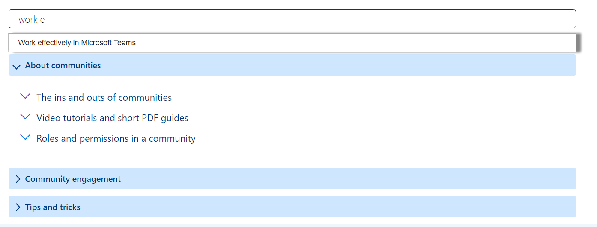

# Frequently Asked Questions App

## Summary

- This Web Part allows users to create Frequently Asked Questions (FAQ App) in modern and classic SharePoint pages.
- This webpart allows users to search within questions and answers which are stored in a SharePoint FAQ list.
#### FAQ LIST
#### FAQ Webpart

## Prerequisites

- A FAQ List (SharePoint List) should be created wherever the webpart needs to be added with the following fields.
Column Name|Field Type
-------|----
`QuestionEN`|Single line of text
`QuestionFR`|Single line of text
`AnswerEN`|Multiple lines of text
`AnswerFR`|Multiple lines of text
`CategoryNameEN`|Single line of text
`CategoryNameFR`|Single line of text
`CategorySortOrder`|Number
`QuestionSortOrder`|Number

- Created List Name should be given in the List Name field in the property pane
- To test the webpart in the workbench, FAQ List should be created in the home page of the site
## API permission
List of api permission that need to be approve by a sharepoint admin.

## Version 

Used SharePoint Framework Webpart or Sharepoint Framework Extension 

## Applies to

- [SharePoint Framework](https://aka.ms/spfx)
- [Microsoft 365 tenant](https://docs.microsoft.com/en-us/sharepoint/dev/spfx/set-up-your-developer-tenant)

> Get your own free development tenant by subscribing to [Microsoft 365 developer program](http://aka.ms/o365devprogram)

## Version history

Version|Date|Comments
-------|----|--------
1.0|Dec 9, 2021|Initial release
1.1|March 25, 2022|Next release

## Minimal Path to Awesome

- Clone this repository
- Ensure that you are at the solution folder
- In the command-line run:
  - **npm install**
  - **gulp serve**
- You will need to add your client id and azure function to the `clientId` and `url` classs members at the top of the filename.tsx file.
- To debug in the front end:
  - go to the `serve.json` file and update `initialPage` to `https://domain-name.sharepoint.com/_layouts/15/workbench.aspx`
  - Run the command **gulp serve**
- To deploy: in the command-line run
  - **gulp bundle --ship**
  - **gulp package-solution --ship**
- Add the webpart to your tenant app store
- Approve the web API permissions

## Disclaimer

**THIS CODE IS PROVIDED *AS IS* WITHOUT WARRANTY OF ANY KIND, EITHER EXPRESS OR IMPLIED, INCLUDING ANY IMPLIED WARRANTIES OF FITNESS FOR A PARTICULAR PURPOSE, MERCHANTABILITY, OR NON-INFRINGEMENT.**